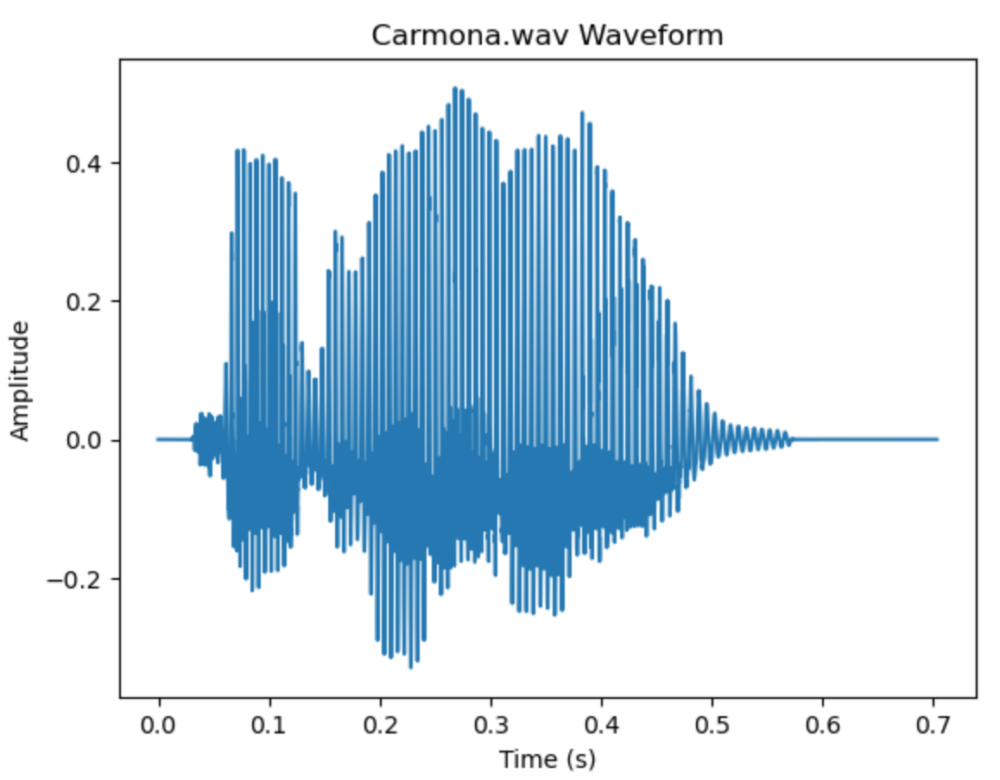
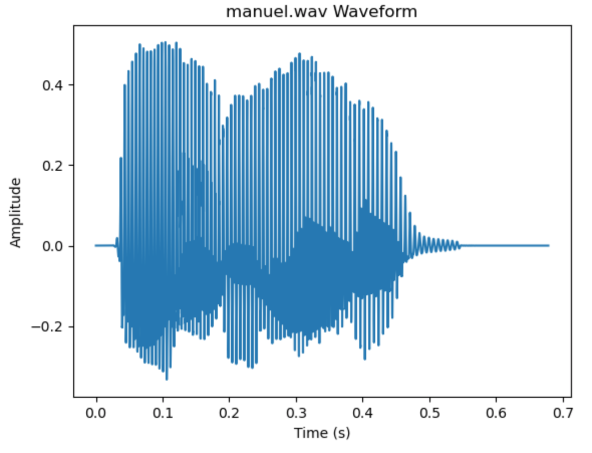
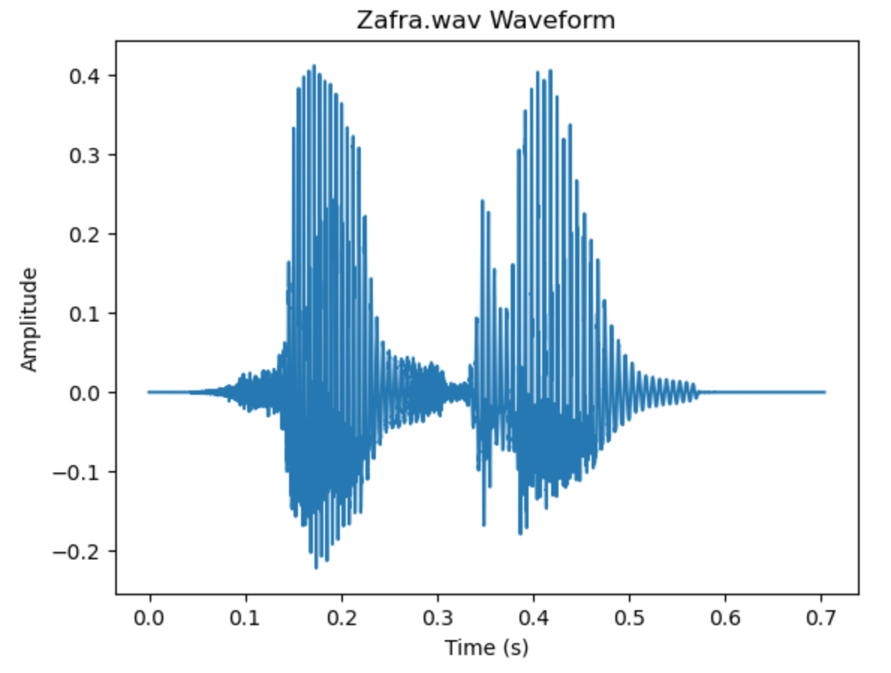
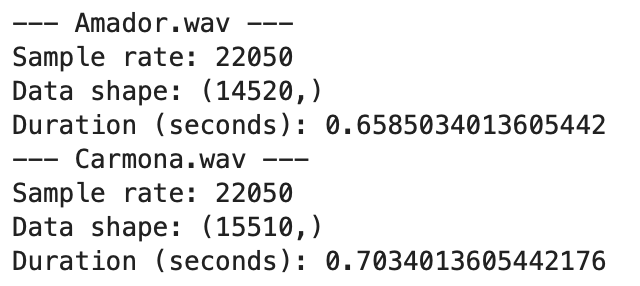
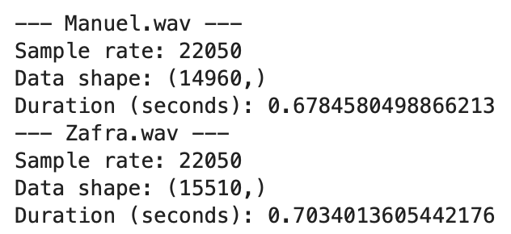

# Practica 5 - Experimentación con el sistema de salida de sonido #

Autores: Amador Carmona Méndez y Manuel Zafra Mota

---

## Introducción ##

Los objetivos concretos de esta práctica son:
• Identificar y representar gráficamente la forma de onda de señales de sonido.
• Conocer la estructura de un fichero típico de sonido (ficheros WAV).
• Entender y operar con los parámetros principales de una señal de sonido.
Para realizar esta práctica vamos a programar para manejar el sonido, utilizando Python.

## Instalación ##
---
Para poder ejecutar nuestra practica debemos tener iunstalado Python en nuestro ordenador ademas de tener instalados los paquetes  wave, numpy, scipy y matplotlib.
Se instalan de la siguiente manera:
~~~Bash
$pip install nombre-paquete
~~~
---

## Ejercicios ##

Para resolver nuestra practica vamos a utilizar las siguientes funciones:
wavfile.read
plt.figure
plt.plot
plt.title
plt.xlabel
plt.ylabel
plt.show
np.concatenate
plot_waveform
signal.butter
signal.lfilter
wavfile.write
np.flip
np.convolve

### Ejercicio 1 ###
Leer dos ficheros de sonido (WAV o MP3) de unos pocos segundos de duración cada uno. En el primero debe escucharse el nombre de la persona que realiza la práctica. En el segundo debe escucharse el apellido.

#### Codigo ####
~~~ Python
# 1. Leer dos ficheros de sonido (WAV o MP3)
fs1, data1 = wavfile.read("Amador.wav")
fs2, data2 = wavfile.read("Carmona.wav")
~~~
### Ejercicio 2 ###
Dibujar la forma de onda de ambos sonidos.
#### Resultado ####

#### Codigo ####
~~~ Python
# 2. Dibujar la forma de onda de ambos sonidos
def plot_waveform(data, fs, title):
duration = len(data) / fs
time = np.linspace(0., duration, len(data))

plt.figure()
plt.plot(time, data)
plt.title(title)
plt.xlabel("Time (s)")
plt.ylabel("Amplitude")
plt.show()

plot_waveform(data1, fs1, "Amador.wav Waveform")
plot_waveform(data2, fs2, "Carmona.wav Waveform")

~~~
### Ejercicio 3 ###
Obtener la información de las cabeceras de ambos sonidos.
#### Resultado ####

#### Codigo ####
~~~ Python
# 3. Obtener la información de las cabeceras de ambos sonidos
def print_audio_info(data, fs, title):
print(f"--- {title} ---")
print("Sample rate:", fs)
print("Data shape:", data.shape)
print("Duration (seconds):", len(data) / fs)

print_audio_info(data1, fs1, "Amador.wav")
print_audio_info(data2, fs2, "Carmona.wav")
~~~
### Ejercicio 4 ###
Unir ambos sonidos en uno nuevo.

#### Codigo ####
~~~ Python
# 4. Unir ambos sonidos en uno nuevo
combined_data = np.concatenate((data1, data2))
~~~
### Ejercicio 5 ###
Dibujar la forma de onda de la señal resultante.
#### Resultado ####

#### Codigo ####
~~~ Python
# 5. Dibujar la forma de onda de la señal resultante
plot_waveform(combined_data, fs1, "Combined Waveform")
~~~
### Ejercicio 6 ###
Pasarle un filtro de frecuencia para eliminar las frecuencias entre 10000Hz y
20000Hz

#### Codigo ####
~~~ Python
# 6. Pasarle un filtro de frecuencia para eliminar las frecuencias entre 10000Hz y 20000Hz
fs1 = 44100  # Frecuencia de muestreo del audio
lowcut = 10000.0
highcut = 20000.0
nyquist = 0.5 * fs1
low = lowcut / nyquist
high = highcut / nyquist

# Crear el filtro de Butterworth
N = 10  # Orden del filtro
Wn = [low, high]  # Frecuencias críticas normalizadas
b, a = signal.butter(N, Wn, btype='bandstop')

~~~
### Ejercicio 7 ###
Almacenar la señal obtenida como un fichero WAV denominado “mezcla.wav”.

~[mezcla de los audios](mezcla.wav)
#### Codigo ####
~~~ Python
# 7. Almacenar la señal obtenida como un fichero WAV denominado "mezcla.wav"
wavfile.write("mezcla.wav", fs1, filtered_data)

~~~
### Ejercicio 8 ###
Cargar un nuevo archivo de sonido, aplicarle eco y a continuación darle la
vuelta al sonido. Almacenar la señal obtenida como un fichero WAV denominado “alreves.wav”.
#### Resultado ####
!~[audio al reves](alreves.wav)

#### Codigo ####
~~~ Python
# 8. Cargar un nuevo archivo de sonido, aplicarle eco y a continuación darle la vuelta al sonido.
fs3, data3 = wavfile.read("AmadorCarmona.wav")

reversed_data = np.flip(data3)
reversed_echo_data = np.convolve(reversed_data, np.ones(10000), mode='same')

# Almacenar la señal obtenida como un fichero WAV denominado "alreves.wav"
wavfile.write("alreves.wav", fs3, reversed_echo_data)
~~~
